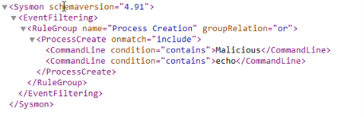
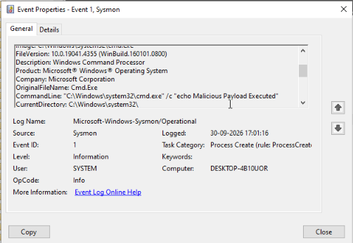

# Project: Windows Endpoint Threat Hunting via Custom Sysmon Telemetry

## Executive Summary
This project demonstrates advanced endpoint threat detection and log analysis within an asset-constrained Windows 10 environment. To optimize resource utilization and bypass standard heavy SIEM overhead, I authored a manual XML telemetry configuration ruleset, injected it into Microsoft Sysmon, simulated an obfuscated command execution attack, and successfully audited the generated indicators of compromise (IOCs) using native Windows Event Viewer.

## Threat Analysis Metrics
* **Target Operating System:** Windows 10 Enterprise
* **Monitored Event ID:** Event ID 1 (Process Creation)
* **Detection Mechanism:** Microsoft Sysmon (System Monitor) v15.22
* **Simulated Attack Vector:** Suspicious Command Shell Payload Injection
* **Captured IOC String:** `cmd.exe /c "echo Malicious Payload Executed"`

---

## Technical Walkthrough & Evidence

### 1. Manual Telemetry Engineering (XML Rule Definition)
Because the triage environment was deliberately sandboxed without external web dependency pathways, I manually generated a localized ruleset using basic text matrices. The configuration targets inbound process execution blocks filtering for explicitly malicious command-line strings.

*Figure 1: Tailored local XML rule logic structured to capture anomalous host process spawning events.*

### 2. Threat Hunt & Log Auditing
After executing the simulated execution attack on the host command-line interface, I refreshed the native system log pipeline. Sysmon successfully tracked the execution vector and parsed the metadata into the system core registry timeline.

*Figure 2: Event Viewer interface isolating Event ID 1 with the target command string exposed in the CommandLine payload field.*

---

## Analytical Conclusions & Mitigations
1. **Rule Validation:** The custom XML parser validated that structural text-matching rules inside Sysmon can efficiently catch malicious parent process behaviors before they execute deeper system scripts.
2. **Defensive Action Plan:** 
   * Mandate the implementation of Microsoft Sysmon across corporate endpoints to supplement default Windows security events.
   * Forward Event ID 1 process telemetry streams directly into central analytic servers to alert responders the moment command-line shell utilities are wrapper-executed by localized user accounts.
